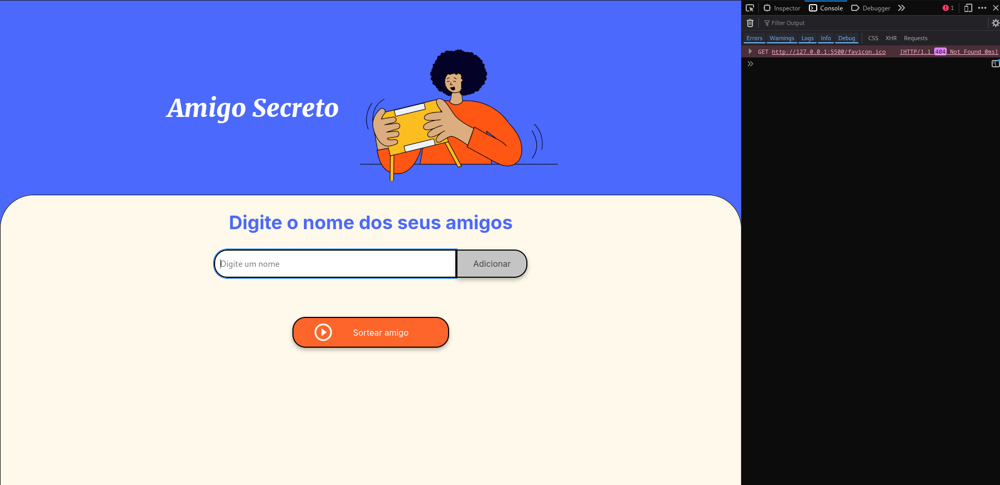
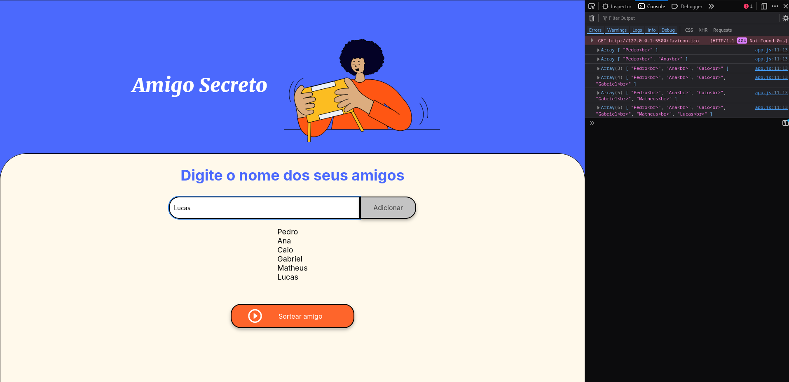
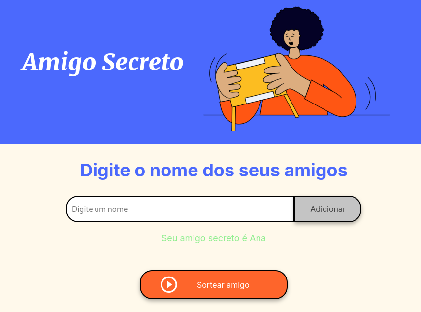

# ChallengeONE - Amigo Secreto

O objetivo do challengeONE foi fazer uma microaplicação capaz de sortear nomes de uma lista, criando assim um pequeno site capaz de sortear nomes para um jogo de amigo secreto.

## Ferramentas utilizadas

**JAVASCRIPT** - Utilizado para fazer a lógica do sorteio. 
**HTML/CSS** - Utilizado para fazer a construção da interface (Modelo pronto fornecido pelos orientadores).

